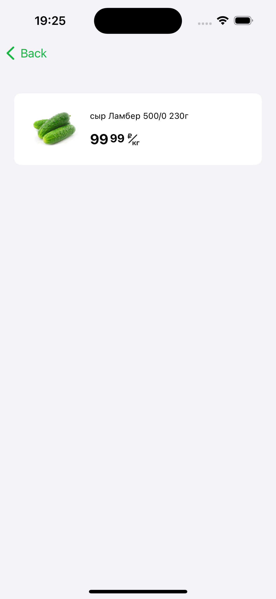

# Internship assignment (Spar)

### Task
Implement product list screen from figma design with list and grid states.

### Stack
- SwiftUI
- MVVM
- Swiftlint via SPM

### Additional feature
- Implemented cart via app environment

### Demo
- Design    

- Main flow  

